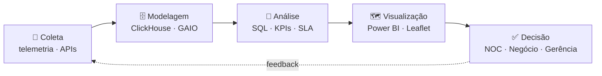
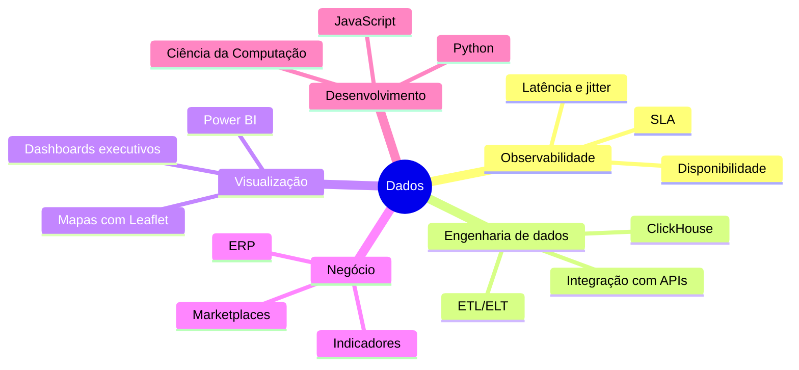

<div align="center">


<a href="https://git.io/typing-svg"></a>

<br/>

<a href="https://www.linkedin.com/in/matteo-servone"></a>
<a href="mailto:matteoservone@gmail.com"></a>


</div>

---

### `> SELECT * FROM sobre_mim;`

```sql
SELECT nome, cargo, foco, experiencia, formacao, status
FROM   perfil
WHERE  usuario = 'MatteoServone';
```

```text
┌─────────────┬────────────────────────────────────────────────┐
│ nome        │ Matteo Servone                                 │
│ cargo       │ Business Data Analyst                          │
│ foco        │ Network Observability · Dashboards · ETL       │
│ experiencia │ Dados desde 2023 · ERP · Marketplaces          │
│ formacao    │ Ciência da Computação · Faculdade Impacta      │
│ status      │ Aberto a oportunidades                         │
└─────────────┴────────────────────────────────────────────────┘
(1 row)
```

Construo **dashboards executivos**, **pipelines analíticos** e **visões geoespaciais** com foco em disponibilidade, performance e insights acionáveis para times de negócio, NOC e engenharia.

---

### 🏢 `experiencia.timeline()`

<div align="center">

| Período | Empresa | Cargo | Destaques |
|:--|:--|:--|:--|
| **Jun/2026 – Atual** | Luma Festas | Auxiliar Administrativo | Estoque no ERP Tiny e normalização de SKUs · Marketplaces (Mercado Livre, Shopee, Amazon, TikTok Shop, Shein) · Classificação fiscal NCM · Automação em Python integrada ao ERP |
| **Jun/2023 – Abr/2026** | PSNE | Analista de Dados Jr | Network Observability · Modelagem em ClickHouse/SQL · ETL/ELT · Arquitetura de dados · Integração com APIs · Dashboards operacionais e executivos · SLA e disponibilidade |
| **Fev/2023 – Abr/2023** | Spectron Eletrônicos | Assistente de E-commerce | Operação no Mercado Livre · Envios FULL/FLEX · Relatórios de vendas em Excel |

</div>

**Projetos de dados na PSNE para:** SONDA · SONDA Infovia · Vivara · WebMotors · Alloha *(POC)*

**O que entrego:**

- 📊 **Dashboards orientados à decisão**: SLA, capacidade, incidentes e qualidade de rede
- 🛰️ **Observabilidade ponta a ponta**: coleta, modelagem e visão geoespacial (Leaflet) com filtros dinâmicos
- ⚡ **Data products** no GAIO + ClickHouse: consultas de alta performance, custo otimizado e governança simples
- 🤖 **Automação de processos** em Python integrada a ERP e marketplaces

---

### 🔄 `pipeline.observabilidade()`



---

### 📊 `dashboard.stack`

<div align="center">

| Categoria | Ferramentas |
|:--|:--|
| **Dados & ETL** |     |
| **Visualização / BI** |    |
| **Linguagens** |    |
| **Sistemas & Ferramentas** |     |

</div>

---

### 🧭 `competencias.map()`



---

### 🎓 `formacao.certificados()`

**Bacharelado em Ciência da Computação** · Faculdade Impacta *(2026 – 2030)*


---

### 📈 `metricas.github()`

<div align="center">


</div>

---

### 🎯 `roadmap.status`

```diff
+ [✔] SQL, SQL Server e ClickHouse para análises de alta performance
+ [✔] Dashboards executivos e operacionais em Power BI
+ [✔] Pipelines de ETL/ELT e integração com APIs
+ [✔] Visões geoespaciais com Leaflet
+ [✔] Automação de processos em Python integrada a ERP
! [▶] Bacharelado em Ciência da Computação
! [▶] Python avançado para análise de dados
- [ ] Desenvolvimento de software: do dado à aplicação
```

---

<div align="center">

> *"Sem dados, você é apenas mais uma pessoa com uma opinião."* — W. Edwards Deming


</div>
